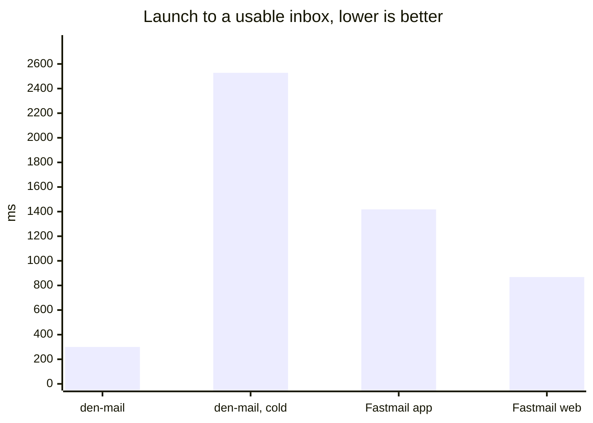
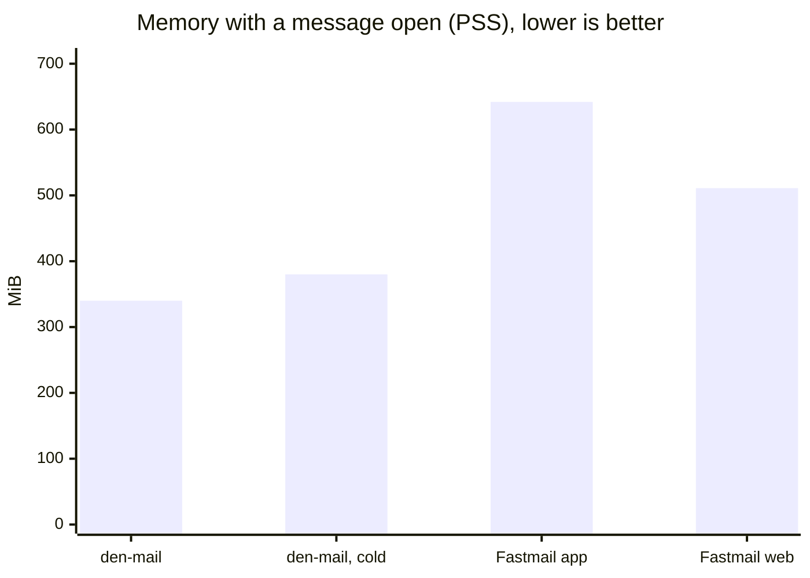

#  Den Mail

[](https://github.com/felsenuboot/den-mail/actions/workflows/ci.yml)
[](https://github.com/felsenuboot/den-mail/actions/workflows/codeql.yml)

Read and write your Fastmail mail on the Linux desktop

Den Mail is a Fastmail client built with GTK 4 and libadwaita. It talks JMAP
to Fastmail directly and keeps a local cache, so it opens at once, works
offline and follows changes as they happen.


> [!NOTE]
> A personal project, written largely with Claude Code and reviewed by a
> human, not audited. It works on my machine (Arch, Hyprland, a Fastmail
> Premium account). No warranty; not affiliated with Fastmail.

## Features

- Conversations in three panes, with labels as Fastmail has them: nested,
  several per message, drag and drop
- Instant folder switches and offline reading from a local cache, updates
  over Fastmail's push stream
- Undo for every action, including sending
- Sanitised HTML mail with remote content blocked until allowed, and a dark
  mode for light-coloured messages
- Send from any alias or wildcard address, create Masked Email addresses
- Select many conversations, group the list by sender, act on a sender at once
- One-click unsubscribe, and a Newsletters dialog to leave many lists at once
- Search operators for sender, recipient, subject, state, label, folder and date
- Desktop notifications with the sender's logo, `mailto:` links, keyboard
  shortcuts

The [tour](docs/TOUR.md) shows each of these, with screenshots and the list
of shortcuts.

## Speed

den-mail against Fastmail's desktop app and web client on the same account,
machine and network; medians of eight runs, lower is better.

| | den-mail | den-mail, cold | Fastmail app | Fastmail web |
| --- | --- | --- | --- | --- |
| launch to a usable inbox, ms | **300** | 2,528 | 1,418 | 868 |
| switch to a folder of 2,900 conversations, ms | 118 | 458 | 204 | **114** |
| search, ms | 186 | 239 | 226 | **180** |
| open a message, first paint, ms | **67** | 179 | 135 | 148 |
| memory with a message open, PSS, MiB | **340** | 380 | 642 | 511 |
| CPU at rest with a message open, % of a core | **0.1** | 0.4 | 2.8 | 0.6 |





The method, the other four charts and the rows behind them are in
[docs/BENCHMARK.md](docs/BENCHMARK.md).

## Install

Python 3.12+, PyGObject, GTK 4, libadwaita 1.5+, libsecret and WebKitGTK 6.0.
Optional: setproctitle, so the process is listed as `den-mail` instead of
`python3`.

```
# Arch
sudo pacman -S --needed python-gobject gtk4 libadwaita libsecret webkitgtk-6.0 python-setproctitle
# Fedora: python3-gobject gtk4 libadwaita libsecret webkitgtk6.0 python3-setproctitle
# Debian/Ubuntu: python3-gi python3-gi-cairo gir1.2-gtk-4.0 gir1.2-adw-1 gir1.2-secret-1 gir1.2-webkit-6.0 python3-setproctitle

git clone https://github.com/felsenuboot/den-mail.git
cd den-mail
./install.sh
```

This adds a launcher, desktop entry and icons for your user. The launcher runs
from the checkout, so `./update.sh` (a pull plus the same install step) is the
whole update. `./bin/den-mail` runs it without installing anything.

On first start the app asks for a Fastmail API token: create one under
*Settings → Privacy & Security → API tokens* with the Mail, Submission and
Masked Email scopes. It is kept in your keyring and only ever sent to Fastmail.

Something off? See [docs/TROUBLESHOOTING.md](docs/TROUBLESHOOTING.md).

## Privacy

The token lives in the system keyring. Remote images stay blocked until you
allow them or trust the sender, attachments download on request, and sender
logos come from the sender's domain (BIMI or favicon), which says nothing about
a particular message; they can be turned off in Preferences.

## Contributing

Bug reports, ideas and pull requests: the
[issue tracker](https://github.com/felsenuboot/den-mail/issues). The inbox
cleanup roadmap is #15. Developer notes are in
[docs/DEVELOPMENT.md](docs/DEVELOPMENT.md), the design in
[ARCHITECTURE.md](ARCHITECTURE.md).

## Name, credits, licence

伝 (*den*) is the Japanese character for passing something on, which is what
mail does; the name follows [Zen Browser](https://zen-browser.app/)'s pattern.
The project started as *fastmail-gtk*, and settings from that name migrate on
their own.

Some symbolic icons are from the
[Adwaita icon theme](https://gitlab.gnome.org/GNOME/adwaita-icon-theme)
(CC BY-SA 3.0 / LGPL); the 伝 calligraphy in the tour is set in
[Yuji Syuku](https://github.com/Kinutafontfactory/Yuji) (OFL).
MIT licence, see [LICENSE](LICENSE).
