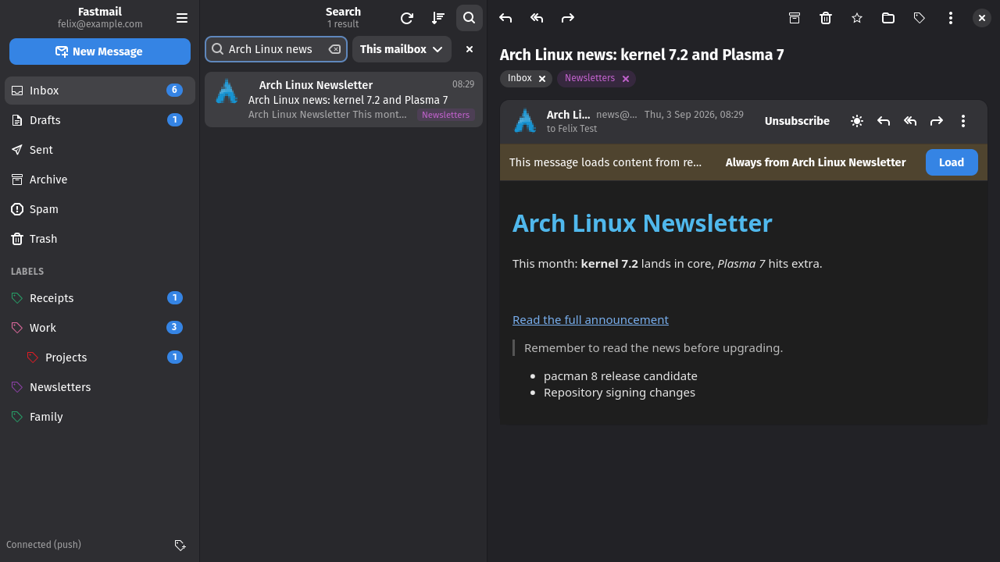

# Fastmail GTK

A native Fastmail client for the GNOME desktop: GTK4, libadwaita and JMAP.
Three panes, labels that nest, push updates, offline reading, and every alias
you own in the From field.


> [!NOTE]
> **This app was written mostly by an AI.** Nearly all of the code was produced
> by Claude Code (Anthropic's coding agent) under my direction. I read and test
> what it writes and use the app daily, but nobody has audited it. It works on
> my machine: Arch Linux, Hyprland, a regular Fastmail account. Use it at your
> own risk; there is no warranty of any kind. Issues and pull requests are
> welcome. This project is not affiliated with or endorsed by Fastmail.

## What it does

- **Mail the Fastmail way.** A message can carry several labels, labels nest,
  and you drag conversations onto them. Inbox shows up as a chip you can remove
  to archive.
- **Fast and offline.** Everything you have looked at sits in a local SQLite
  cache, so switching folders is instant and you can read without a connection.
  Changes arrive over Fastmail's push stream.
- **Actions with undo.** Archive, delete, spam, flag, read, label and move
  happen immediately and can be undone from the toast.
- **Safe HTML.** WebKitGTK renders mail with scripts stripped and remote content
  blocked until you allow it, per message or for trusted senders. Dark mode
  adapts light-coloured mail, with a per-message switch back to the original
  colours.
- **All your identities.** Send from any alias or wildcard address, star the
  ones you use so the From list stays short, and manage Masked Email addresses.
- **Unsubscribe in one click.** Newsletters get an Unsubscribe button that uses
  the sender's one-click endpoint, their web page, or a mailto request.
- **Search and sort.** `from:`, `to:`, `subject:`, `is:unread`, `is:flagged`,
  `has:attachment`, `before:` and `after:`, scoped to a folder or all mail.
  Sorting follows Fastmail's per-folder setting.
- **Desktop integration.** Notifications, `mailto:` handler, sender logos from
  BIMI or favicons, keyboard shortcuts, conversations in their own windows.

| Light theme | Compose |
| --- | --- |
|  |  |



## Installing

You need Python 3.12 or newer with PyGObject, GTK 4, libadwaita 1.5+, libsecret
and, for HTML mail, WebKitGTK 6.0. On Arch Linux:

```
sudo pacman -S --needed python-gobject gtk4 libadwaita libsecret webkitgtk-6.0
```

Fedora: `python3-gobject gtk4 libadwaita libsecret webkitgtk6.0`.
Debian and Ubuntu: `python3-gi gir1.2-gtk-4.0 gir1.2-adw-1 gir1.2-secret-1 gir1.2-webkit-6.0`.

Then:

```
git clone https://github.com/felsenuboot/fastmail-gtk.git
cd fastmail-gtk
./install.sh
```

This puts a launcher in `~/.local/bin`, a desktop entry and icons in your user
profile, so the app shows up in your app grid and can be set as the `mailto:`
handler. You can also just run `./bin/fastmail-gtk` from the checkout. Without
WebKitGTK the app still works and shows HTML mail as formatted text.

## Getting started

On first start the app asks for a Fastmail API token. Create one in the
Fastmail web app under *Settings → Privacy & Security → API tokens* with the
**Mail**, **Submission** and **Masked Email** scopes. The token goes into your
keyring; the app never writes it anywhere else.

Things worth knowing:

- Right-click a folder or label for refresh, mark all as read, colours, rename,
  new sub-label. Right-click a conversation for the full action menu.
- Double-click or press Enter on a conversation to open it in its own window.
- Preferences → Reading lets you choose how remote images are handled, whether
  dark mode adapts HTML mail, and whether links open in a new browser window.
- Preferences → Composing → Favourite identities opens the identities dialog,
  where you star the aliases you actually send from.

### Keyboard shortcuts

| Keys | Action |
| --- | --- |
| `j` / `k`, arrows | next / previous conversation |
| `Return` / `o` | open conversation (narrow layout) |
| `c`, `Ctrl+N` | new message |
| `r` / `a` / `f` | reply / reply all / forward |
| `e` | archive |
| `#`, `Delete` | delete |
| `!` | mark as spam |
| `s` | flag / unflag |
| `Shift+U` / `Shift+I` | mark unread / read |
| `l` / `v` | labels / move to |
| `/`, `Ctrl+F` | search |
| `F5`, `Ctrl+R` | refresh |
| `Ctrl+Return` | send (compose) |
| `Ctrl+S` | save draft (compose) |
| `Ctrl+?` | shortcuts dialog |

## Privacy and security

The API token is stored in the system keyring (libsecret) and only ever sent
to the JMAP session URL you sign in with. HTML mail is sanitised before it
reaches WebKitGTK (scripts, frames and forms removed, JavaScript disabled),
remote content stays blocked until you allow it or trust the sender, and
attachments are downloaded on request only. Sender logos are fetched from the
sender's domain (BIMI record or favicon), which reveals nothing about a
specific message; turn them off in Preferences → Appearance if you prefer.

## Troubleshooting

- **The light theme looks half dark.** Wallpaper theming tools (Matugen, pywal,
  ML4W) write `~/.config/gtk-4.0/colors.css`, which repaints every GTK app. The
  app re-asserts libadwaita's light palette while it is light, so Light means
  light; accent colours still come from your desktop.
- **Label colours differ from the web app.** Fastmail does not expose label
  colours through its public JMAP API, so the app assigns its own. Right-click
  a label → Colour to pick one.
- **Clicking a link does not bring the browser forward.** That is the
  compositor's decision (xdg-activation). GNOME and KDE allow it; on Hyprland
  enable `misc.focus_on_activate`. Or turn on "Open links in a new browser
  window" in Preferences → Reading.
- **HTML mail shows up blank.** The app already disables WebKit's DMA-BUF
  renderer, which fixed this on an NVIDIA/Wayland setup. If it still happens,
  please open an issue with your GPU and driver.

## Contributing

Bug reports, ideas and pull requests are welcome on the
[issue tracker](https://github.com/felsenuboot/fastmail-gtk/issues). The inbox
cleanup roadmap (categories, cleanup views, optional local classifiers) is
tracked in #15. Developer notes, including the fake JMAP server the tests run
against and how screenshots are made, are in
[docs/DEVELOPMENT.md](docs/DEVELOPMENT.md); the design is described in
[ARCHITECTURE.md](ARCHITECTURE.md).

Aliases cannot be created through Fastmail's public API (only Masked Email
can), so the app links to the web settings for that.

## Credits and licence

Some symbolic icons are copied from the
[Adwaita icon theme](https://gitlab.gnome.org/GNOME/adwaita-icon-theme)
(CC BY-SA 3.0 / LGPL) so the app renders correctly with any icon theme.

Licensed under the MIT licence, see [LICENSE](LICENSE).
