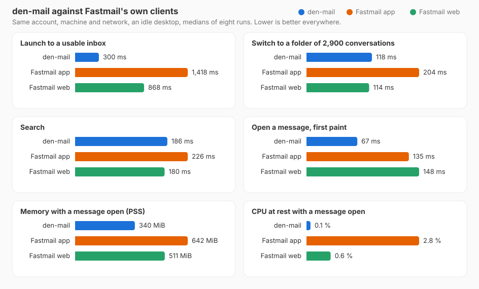

#  Den Mail

[](https://github.com/felsenuboot/den-mail/actions/workflows/ci.yml)
[](https://github.com/felsenuboot/den-mail/actions/workflows/codeql.yml)

A Fastmail client for the Linux desktop. GTK 4 and libadwaita, so it looks
and behaves like a GNOME app; JMAP straight to Fastmail, with a local cache
that makes it fast and lets you read offline.


> [!NOTE]
> A personal project, written largely with Claude Code and reviewed by a
> human, not audited. It works on my machine (Arch, Hyprland, a Fastmail
> Premium account). No warranty; not affiliated with Fastmail.

## What it does

- Three panes, conversations, and labels the way Fastmail has them: a message
  can carry several, labels nest, and dropping the Inbox chip archives.
- Folder switches come from a SQLite cache, changes arrive over Fastmail's push
  stream, and everything you have opened stays readable offline.
- Every action is immediate and undoable from a toast, including sending, which
  waits a few seconds first.
- HTML mail is sanitised, remote content stays blocked until you allow it, and
  dark mode adapts light-coloured messages.
- Send from any alias or wildcard address; create and manage Masked Email.
- Multi-select, group the list by sender, fold groups, act on a whole sender.
- Unsubscribe from a message with one click, or from many senders at once in
  the Newsletters dialog, clearing out their mail in the same step.
- Search with `from:` `to:` `subject:` `is:` `has:` `label:` `in:` `before:`
  `after:` `older_than:7d` and quoted phrases.
- Notifications with the sender's logo, `mailto:` links, keyboard shortcuts.

The [tour](docs/TOUR.md) shows all of this, with screenshots and the list of
shortcuts.

## Speed

<picture>
  <source media="(prefers-color-scheme: dark)" srcset="docs/benchmark/2026-09-04-dark.svg">
  
</picture>

Same account, machine and network, medians of eight runs. Method and numbers:
[docs/BENCHMARK.md](docs/BENCHMARK.md).

## Install

Python 3.12+, PyGObject, GTK 4, libadwaita 1.5+, libsecret and WebKitGTK 6.0.
Optional: setproctitle, so the process is listed as `den-mail` instead of
`python3`.

```
# Arch
sudo pacman -S --needed python-gobject gtk4 libadwaita libsecret webkitgtk-6.0 python-setproctitle
# Fedora: python3-gobject gtk4 libadwaita libsecret webkitgtk6.0 python3-setproctitle
# Debian/Ubuntu: python3-gi python3-gi-cairo gir1.2-gtk-4.0 gir1.2-adw-1 gir1.2-secret-1 gir1.2-webkit-6.0 python3-setproctitle

git clone https://github.com/felsenuboot/den-mail.git
cd den-mail
./install.sh
```

This adds a launcher, desktop entry and icons for your user. The launcher runs
from the checkout, so `./update.sh` (a pull plus the same install step) is the
whole update. `./bin/den-mail` runs it without installing anything.

On first start the app asks for a Fastmail API token: create one under
*Settings → Privacy & Security → API tokens* with the Mail, Submission and
Masked Email scopes. It is kept in your keyring and only ever sent to Fastmail.

Something off? See [docs/TROUBLESHOOTING.md](docs/TROUBLESHOOTING.md).

## Privacy

The token lives in the system keyring. Remote images stay blocked until you
allow them or trust the sender, attachments download on request, and sender
logos come from the sender's domain (BIMI or favicon), which says nothing about
a particular message; they can be turned off in Preferences.

## Contributing

Bug reports, ideas and pull requests: the
[issue tracker](https://github.com/felsenuboot/den-mail/issues). The inbox
cleanup roadmap is #15. Developer notes are in
[docs/DEVELOPMENT.md](docs/DEVELOPMENT.md), the design in
[ARCHITECTURE.md](ARCHITECTURE.md).

## Name, credits, licence

伝 (*den*) is the Japanese character for passing something on, which is what
mail does; the name follows [Zen Browser](https://zen-browser.app/)'s pattern.
The project started as *fastmail-gtk*, and settings from that name migrate on
their own.

Some symbolic icons are from the
[Adwaita icon theme](https://gitlab.gnome.org/GNOME/adwaita-icon-theme)
(CC BY-SA 3.0 / LGPL); the 伝 calligraphy in the tour is set in
[Yuji Syuku](https://github.com/Kinutafontfactory/Yuji) (OFL).
MIT licence, see [LICENSE](LICENSE).
