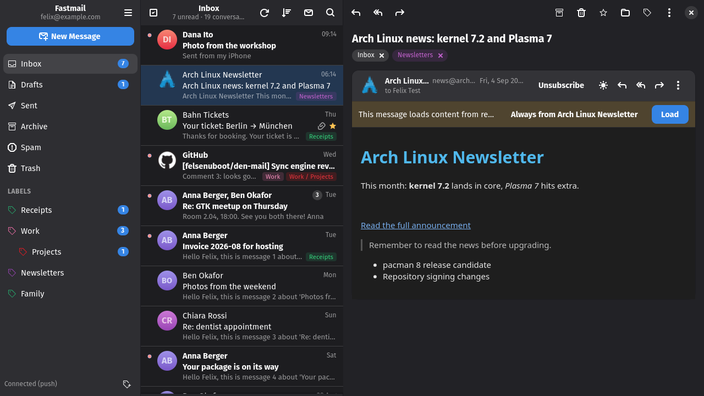

<div align="center">
  
  <h1>Den Mail</h1>
  <p>A Fastmail client for GNOME</p>
  <a href="https://github.com/felsenuboot/den-mail/actions/workflows/ci.yml"></a>
  <a href="https://github.com/felsenuboot/den-mail/actions/workflows/codeql.yml"></a>
</div>

Den Mail is a Fastmail client built with GTK 4 and libadwaita. It talks JMAP
to Fastmail directly and keeps a local cache, so it opens at once, works
offline and follows changes as they happen.



> [!NOTE]
> A personal project, written largely with Claude Code and reviewed by a
> human, not audited. It works on my machine (Arch, Hyprland, a Fastmail
> Premium account). No warranty; not affiliated with Fastmail.

## Features

- 🏷️ **Labels.** Nested, several per message, drag and drop, as in Fastmail.
- 💾 **Offline.** A local cache makes folder switches instant and keeps mail
  readable without a connection; changes arrive by push.
- ↩️ **Undo.** Every action can be taken back from a toast, sending included.
- ⏰ **Send later.** Schedule a message for a preset or any time; cancel it until it goes.
- 🛡️ **Safe HTML.** Sanitised mail, remote content blocked until you allow it,
  dark mode for light-coloured messages.
- 👤 **Identities.** Send from any alias or wildcard address; manage Masked Email.
- ☑️ **Bulk actions.** Select many conversations, group by sender, act on a
  whole sender at once.
- 🚫 **Unsubscribe.** One click per message, or many senders at once in the
  Newsletters dialog.
- 🔍 **Search.** Operators for sender, subject, state, label, folder and date.
- 🗂️ **Categories.** Every message is sorted locally into Primary, Transactions,
  Security, Updates, Newsletters, Lists or Promotions from its headers, sender
  and wording; a chip on the row and a filter in the list header. Correct one
  and the app learns from it.
- 👓 **Views.** Newsletters, Transactions, Security, Updates, Never read and
  Big attachments in the sidebar, answered from the local cache in an instant.
- 🚪 **Screener.** Optionally hold mail from first-time senders outside the
  Inbox until you let them through or screen them out.
- 🧹 **Clean up.** Senders ranked by how pointless their mail looks, with
  bulk archive, delete, mark read and unsubscribe per sender.
- 📐 **Rules.** Always label, archive, read or delete mail from a sender,
  a domain, a list or a category, applied as it arrives.
- 🔔 **Desktop.** Notifications with the sender's logo, `mailto:` links, keyboard
  shortcuts.

The [tour](docs/TOUR.md) shows each of these with screenshots, and
[docs/BENCHMARK.md](docs/BENCHMARK.md) compares speed and memory with
Fastmail's desktop app and web client.

## Install

Python 3.12+, PyGObject, GTK 4, libadwaita 1.5+, libsecret and WebKitGTK 6.0.
Optional: setproctitle, so the process is listed as `den-mail` instead of
`python3`.

```
# Arch
sudo pacman -S --needed python-gobject gtk4 libadwaita libsecret webkitgtk-6.0 python-setproctitle
# Fedora: python3-gobject gtk4 libadwaita libsecret webkitgtk6.0 python3-setproctitle
# Debian/Ubuntu: python3-gi python3-gi-cairo gir1.2-gtk-4.0 gir1.2-adw-1 gir1.2-secret-1 gir1.2-webkit-6.0 python3-setproctitle

git clone https://github.com/felsenuboot/den-mail.git
cd den-mail
./install.sh
```

This adds a launcher, desktop entry and icons for your user. The launcher runs
from the checkout, so `./update.sh` (a pull plus the same install step) is the
whole update. `./bin/den-mail` runs it without installing anything.

On first start the app asks for a Fastmail API token: create one under
*Settings → Privacy & Security → API tokens* with the Mail, Submission and
Masked Email scopes. It is kept in your keyring and only ever sent to Fastmail.

Something off? See [docs/TROUBLESHOOTING.md](docs/TROUBLESHOOTING.md).

## Privacy

The token lives in the system keyring. Remote images stay blocked until you
allow them or trust the sender, attachments download on request, and sender
logos come from the sender's domain (BIMI or favicon), which says nothing about
a particular message; they can be turned off in Preferences.

## Contributing

Bug reports, ideas and pull requests: the
[issue tracker](https://github.com/felsenuboot/den-mail/issues). The inbox
cleanup roadmap is #15. Developer notes are in
[docs/DEVELOPMENT.md](docs/DEVELOPMENT.md), the design in
[ARCHITECTURE.md](ARCHITECTURE.md).

## Name, credits, licence

伝 (*den*) is the Japanese character for passing something on, which is what
mail does; the name follows [Zen Browser](https://zen-browser.app/)'s pattern.
The project started as *fastmail-gtk*, and settings from that name migrate on
their own.

Some symbolic icons are from the
[Adwaita icon theme](https://gitlab.gnome.org/GNOME/adwaita-icon-theme)
(CC BY-SA 3.0 / LGPL); the 伝 calligraphy in the tour is set in
[Yuji Syuku](https://github.com/Kinutafontfactory/Yuji) (OFL).
MIT licence, see [LICENSE](LICENSE).
