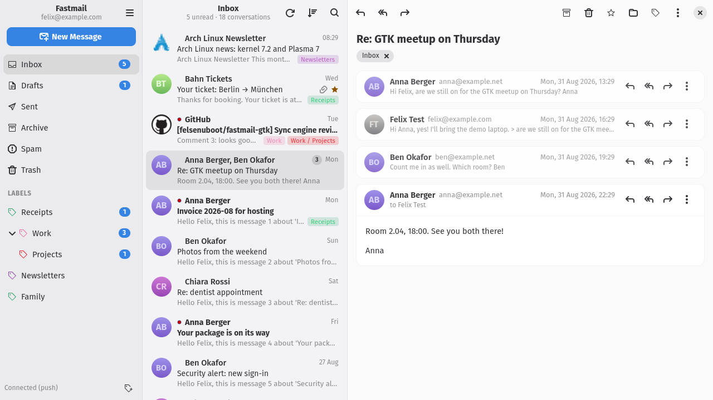
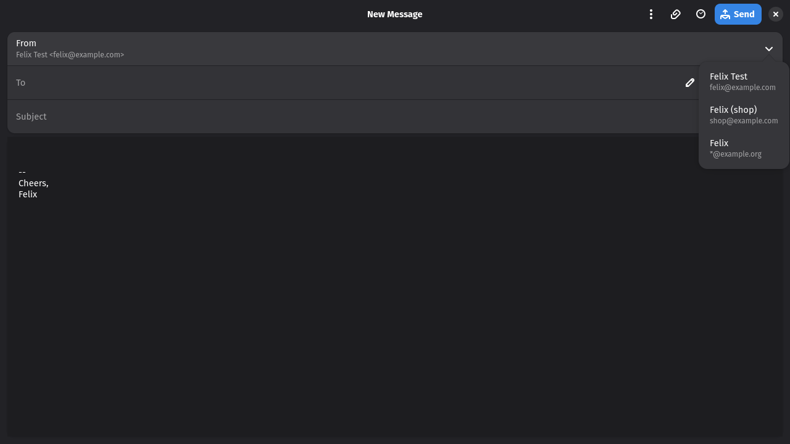

#  Den Mail

A native Fastmail client for the GNOME desktop: GTK4, libadwaita and JMAP.
Three panes, labels that nest, push updates, offline reading, and every alias
you own in the From field.


> [!NOTE]
> **This app was written mostly by an AI.** Nearly all of the code was produced
> by Claude Code (Anthropic's coding agent) under my direction. I read and test
> what it writes and use the app daily, but nobody has audited it. It works on
> my machine: Arch Linux, Hyprland, a regular Fastmail account. Use it at your
> own risk; there is no warranty of any kind. Issues and pull requests are
> welcome. This project is not affiliated with or endorsed by Fastmail.

## Features

- **Labels, the Fastmail way.** Messages carry several labels, labels nest, and
  you drag conversations onto them. Removing the Inbox chip archives.
- **Fast and offline.** A local SQLite cache makes folder switches instant and
  lets you read without a connection. Changes arrive over Fastmail's push stream.
- **Undo for everything.** Archive, delete, spam, flag, read, label and move
  happen immediately and can be undone from the toast.
- **Safe HTML.** Scripts stripped, remote content blocked until you allow it,
  dark mode that adapts light-coloured mail (with a per-message switch back).
- **All your identities.** Send from any alias or wildcard address, star the
  ones you use, manage Masked Email addresses.
- **Bulk actions.** Ctrl/Shift-click or the Select button with checkboxes;
  group by sender (any sort order), fold groups, act on a whole sender at once.
- **One-click unsubscribe**, search operators
  (`from:` `to:` `subject:` `is:unread` `has:attachment` `before:` `after:`),
  notifications with the sender's logo, `mailto:` handling, keyboard shortcuts.

| Light theme | Compose |
| --- | --- |
|  |  |

## Install

Python 3.12+, PyGObject, GTK 4, libadwaita 1.5+, libsecret and, for HTML mail,
WebKitGTK 6.0.

```
# Arch
sudo pacman -S --needed python-gobject gtk4 libadwaita libsecret webkitgtk-6.0
# Fedora: python3-gobject gtk4 libadwaita libsecret webkitgtk6.0
# Debian/Ubuntu: python3-gi gir1.2-gtk-4.0 gir1.2-adw-1 gir1.2-secret-1 gir1.2-webkit-6.0

git clone https://github.com/felsenuboot/den-mail.git
cd den-mail
./install.sh
```

That adds a launcher, desktop entry and icons to your user profile. You can
also run `./bin/den-mail` straight from the checkout.

On first start the app asks for a Fastmail API token. Create one under
*Settings → Privacy & Security → API tokens* with the **Mail**, **Submission**
and **Masked Email** scopes. It is stored in your keyring and sent only to the
JMAP session URL.

<details>
<summary>Keyboard shortcuts</summary>

| Keys | Action |
| --- | --- |
| `j` / `k`, arrows | next / previous conversation |
| `Return` / `o` | open conversation (narrow layout) |
| `c`, `Ctrl+N` | new message |
| `r` / `a` / `f` | reply / reply all / forward |
| `e` | archive |
| `#`, `Delete` | delete |
| `!` | mark as spam |
| `s` | flag / unflag |
| `Shift+U` / `Shift+I` | mark unread / read |
| `l` / `v` | labels / move to |
| `/`, `Ctrl+F` | search |
| `F5`, `Ctrl+R` | refresh |
| `Ctrl+Return` / `Ctrl+S` | send / save draft (compose) |
| `Ctrl+?` | shortcuts dialog |

</details>

<details>
<summary>Troubleshooting</summary>

- **The light theme looks half dark.** Wallpaper theming tools (Matugen, pywal,
  ML4W) write `~/.config/gtk-4.0/colors.css`, which repaints every GTK app. The
  app re-asserts libadwaita's light palette, so Light means light.
- **Label colours differ from the web app.** Fastmail's public JMAP API does not
  expose them, so the app assigns its own. Right-click a label → Colour.
- **Clicking a link does not bring the browser forward.** That is the
  compositor's call (xdg-activation). On Hyprland enable
  `misc.focus_on_activate`, or turn on "Open links in a new browser window" in
  Preferences → Reading.
- **HTML mail shows up blank.** WebKit's DMA-BUF renderer is already disabled,
  which fixed this on an NVIDIA/Wayland setup. If it still happens, open an
  issue with your GPU and driver.
- **Aliases cannot be created in the app.** Fastmail's public API does not
  allow it (only Masked Email), so the app links to the web settings.

</details>

## Privacy

The API token lives in the system keyring (libsecret). HTML mail is sanitised
before it reaches WebKitGTK, remote content stays blocked until you allow it or
trust the sender, and attachments download on request only. Sender logos are
fetched from the sender's domain (BIMI record or favicon), which reveals nothing
about a specific message; turn them off in Preferences → Appearance.

## Contributing

Bug reports, ideas and pull requests are welcome on the
[issue tracker](https://github.com/felsenuboot/den-mail/issues). The inbox
cleanup roadmap is tracked in #15. Developer notes are in
[docs/DEVELOPMENT.md](docs/DEVELOPMENT.md), the design in
[ARCHITECTURE.md](ARCHITECTURE.md).

## About the name

**伝** (*den*) is the Japanese character for conveying, transmitting, passing
something on, which is what mail does. The two-syllable name with a mail suffix
follows the example of [Zen Browser](https://zen-browser.app/). The project
started as *fastmail-gtk*; settings and the keyring token from that name migrate
automatically.

## Credits and licence

Some symbolic icons come from the
[Adwaita icon theme](https://gitlab.gnome.org/GNOME/adwaita-icon-theme)
(CC BY-SA 3.0 / LGPL). The app icon uses Fastmail's brand blue.

MIT licence, see [LICENSE](LICENSE).
