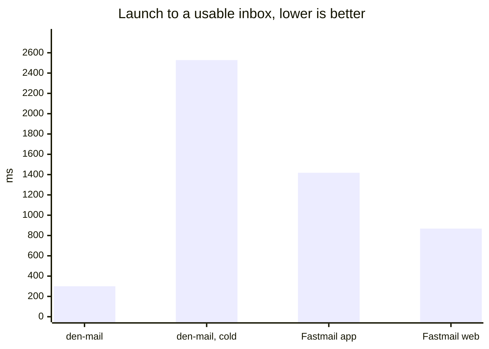
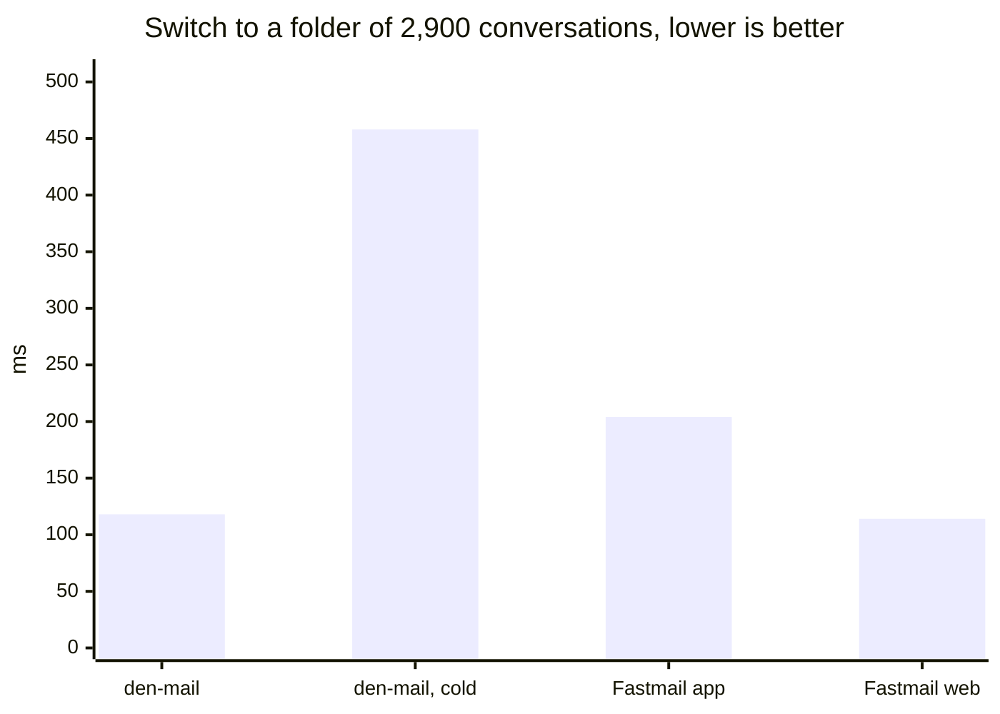
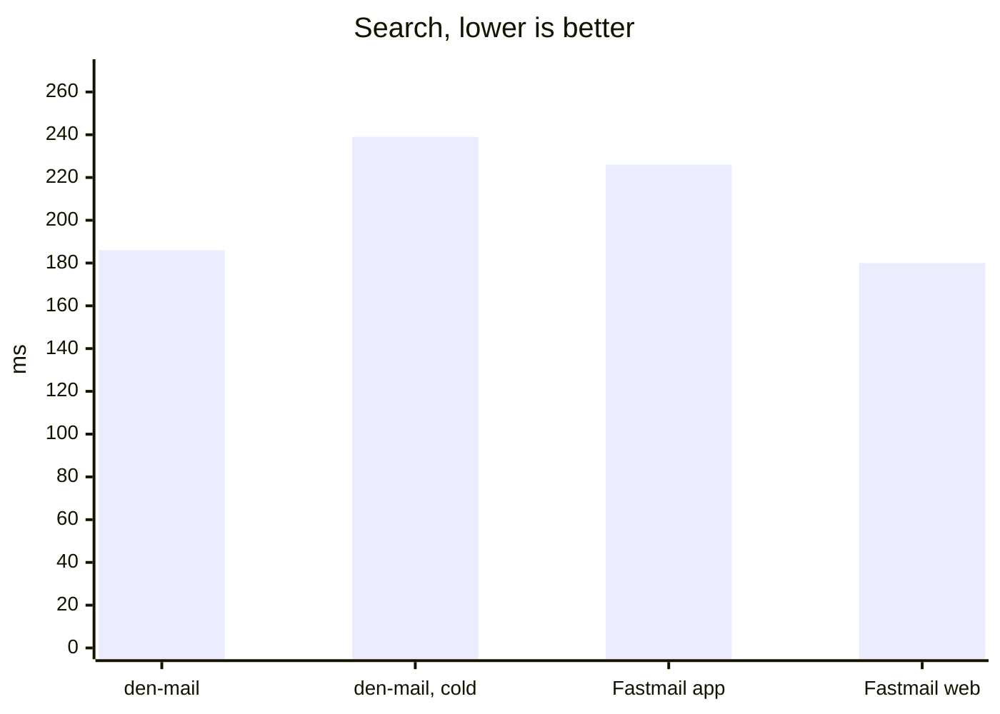
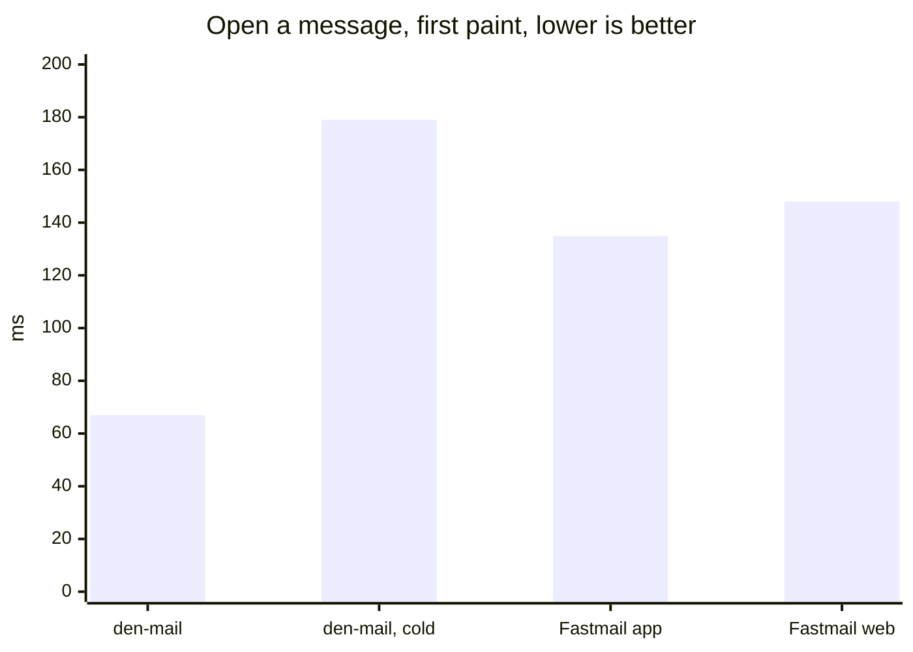
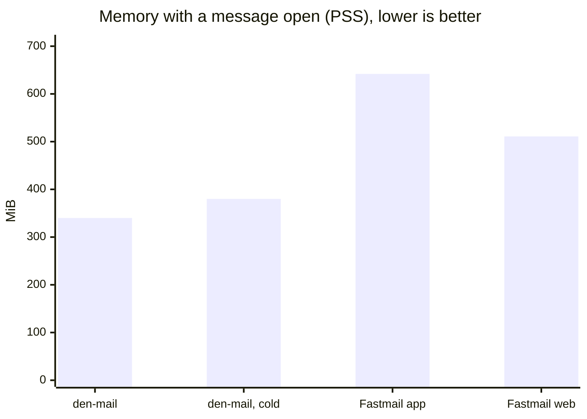
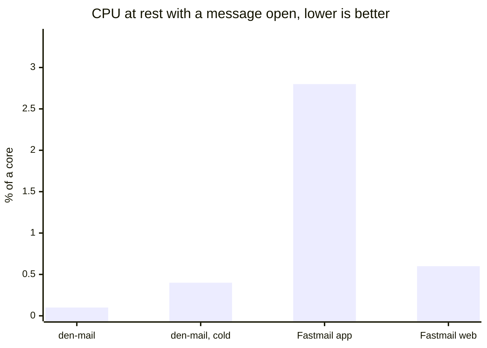

# Benchmark

den-mail against Fastmail's desktop app and web client: the same account, the
same machine and network, the same window size and scenario, on an idle
desktop. Lower is better in every chart.

| medians, 2026-09-04 | den-mail warm | den-mail cold | Fastmail app | Fastmail web |
| --- | --- | --- | --- | --- |
| launch to a usable inbox, ms | **300** | 2,528 | 1,418 | 868 |
| switch to Archive (2,901 conversations), ms | 118 | 458 | 204 | **114** |
| search, ms | 186 | 239 | 226 | **180** |
| open a message: subject shown, ms | **17** | 125 | 110 | 66 |
| open a message: body painted, ms | **67** | 179 | 135 | 148 |
| memory with the message open, PSS, MiB | **340** | 380 | 642 | 511 |
| CPU seconds for the scenario | **2.3** | 4.0 | 4.6 | 3.0 |
| CPU over 20 s at rest, % of a core | **0.1** | 0.4 | 2.8 | 0.6 |

- **Start-up** is den-mail's strength: the inbox comes from the local cache and
  the server's answer only refreshes it. Cold (no cache) it needs 2.5 s for the
  first sync; cold folder switches are server fetches for every client.
- **Folder switch and search** are level with the web client; search is the
  server's time for everyone.
- **Opening a message** is fast because the message views share one WebKit
  process, warmed at start-up.
- **Memory** is proportional set size, so shared pages count once; RSS summed
  over a process tree (in the rows) flatters nobody and means little.
- **Warm is the honest comparison**: the web client and the app keep their own
  caches between runs too.

The rows are in [`benchmark/results-2026-09-04.jsonl`](benchmark/results-2026-09-04.jsonl)
(eight runs per client for the timings, three for CPU; den-mail a88f9f9,
Flathub app 1.7.0, Chromium 150 for the web client) and `bench/charts.py`
writes the charts (Mermaid for GitHub, SVG for elsewhere) from them.

## Method

One scenario for all three: start and wait for the Inbox; switch to Archive;
search "rechnung"; back to the Inbox; open the first conversation; rest 20 s;
quit. Everything runs on the real desktop session, because the headless
compositor renders in software and would penalise nothing but den-mail.

| Metric | den-mail | Fastmail app and web |
| --- | --- | --- |
| launch to inbox, switch, search, open | `timing:` marks the app logs with `DEN_MAIL_TIMING=1` | the URL names the folder and the first row has changed; the subject heading, then the body text is in the page |
| body painted | WebKit reports the load finished | the body text is in the page and a frame has been drawn |
| memory, CPU | the process tree, WebKit helpers included | the process tree, Electron or Chromium helpers included |

The web and app moments are DOM states a few frames ahead of the paint, so
their numbers are, if anything, flattering. Runs on a busy machine are not
comparable: an earlier round during a compiler build read three times slower.

Running it: `bench/den-mail.sh 5 warm|cold` (needs `DEN_MAIL_TOKEN`; a
separate profile, mark-read-on-open off), `bench/web.py app 5` and
`bench/web.py web 5` (Playwright in `bench/venv`, the desktop app from Flathub
started with a debugging port, one manual login each), `bench/report.py` for
the table and `bench/charts.py` for the charts. A quiet machine and twenty
minutes of hands off are the only other requirements.
