# Den Mail tour

> **伝** 〔でん · *den*〕 noun
> 1. legend; tradition
> 2. biography; life
> 3. method; way
> 4. horseback transportation and communication relay system used in ancient Japan
>
> **伝** 〔つて · *tsute*〕 noun
> 1. means of making contact; intermediary; go-between
> 2. connections; influence; pull; good offices
>
> usually written using kana alone; also 伝手, ツテ · [jisho.org](https://jisho.org/search/%E4%BC%9D)

 

## Reading mail

Three panes: folders and labels, the conversation list, the open conversation.
Labels show as chips on each row and in the conversation header; removing the
Inbox chip archives. Newsletters get an **Unsubscribe** button, and remote
images stay blocked until you allow them for that message or trust the sender.

The same view in both themes. Dark mode adapts light-coloured HTML mail; the
sun button in the message header switches a message back to its original
colours.

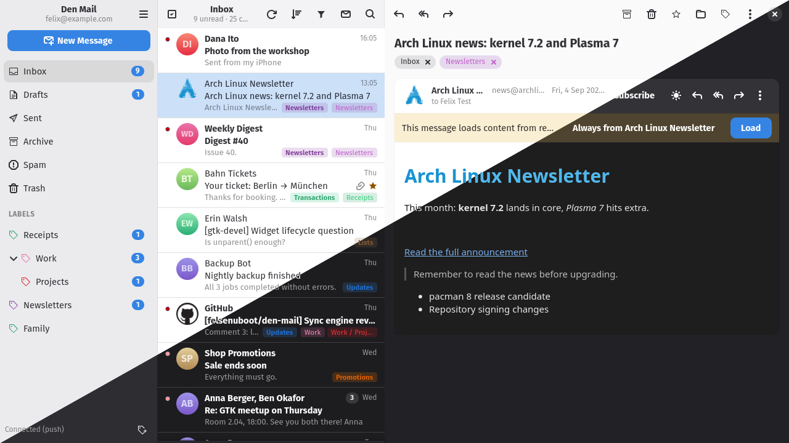

## Grouping and bulk actions

**Group by sender** (or by organisation, which merges `lippu.vr.fi` and
`tili.vr.fi`) works on top of any sort order. Each sender is a card: its
header row selects the whole group, the arrow at its end folds it, and the
button in the header bar folds or unfolds everything.

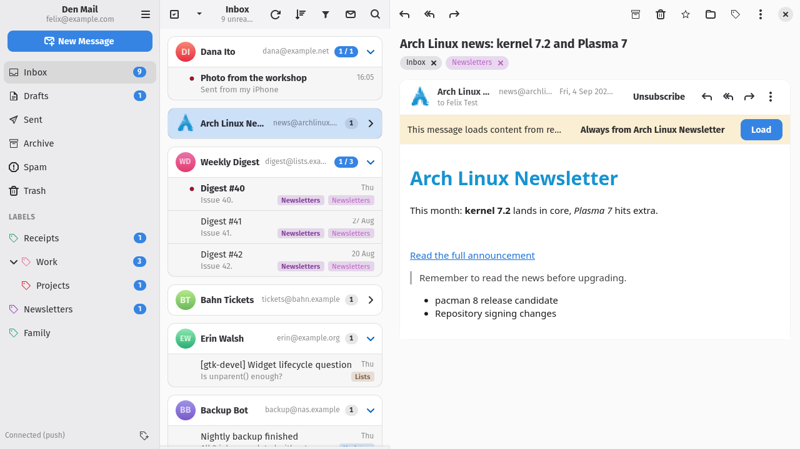

Cleaning out one sender in four steps: group, fold everything, tick the
sender, archive. Undo is in the toast.

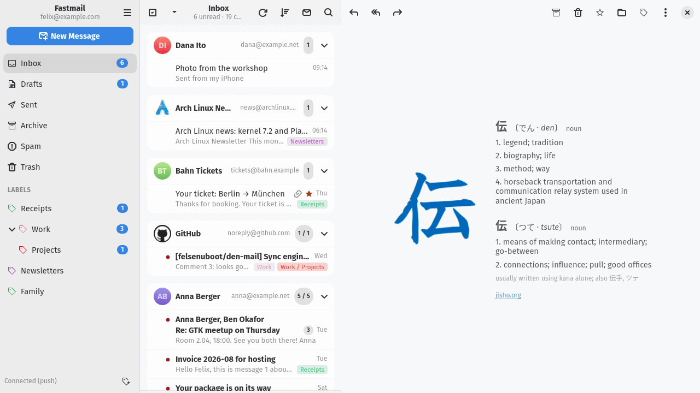

The **Select** button turns on checkboxes and a bar with the bulk actions.
Outside that mode, Ctrl-click and Shift-click extend the selection as usual.

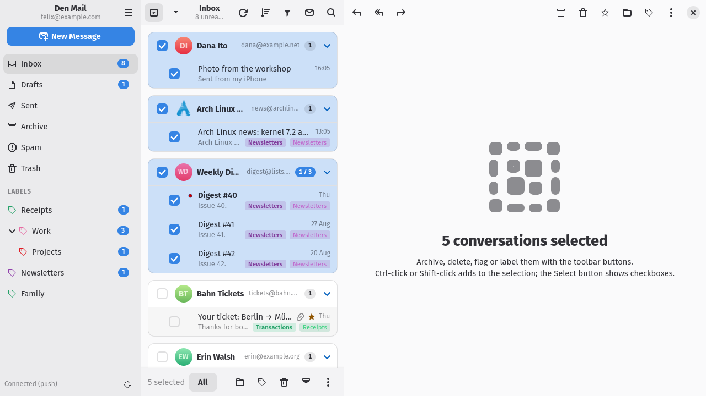

Labels and folders are one click away from the toolbar, the right-click menu,
or the `l` and `v` keys. Everything can be undone from the toast.

| Labels popover | Context menu |
| --- | --- |
| 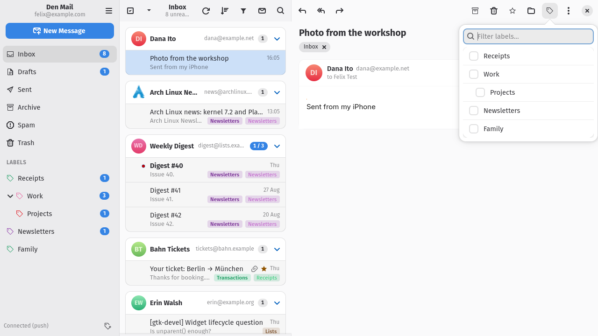 | 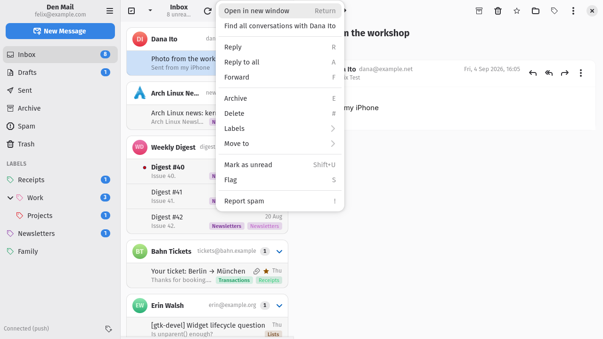 |

## Search

The search box is scoped to the current folder or to all mail. With the
scope set to all mail and no query, the list shows the whole account, which
is where grouping by sender is most useful. Bare words search everything;
`"a quoted phrase"` must appear as written, and quotes work inside an
operator too (`from:"Anna Berger"`).

| Operator | Meaning |
| --- | --- |
| `from:` `to:` `cc:` `subject:` | match one header |
| `is:unread` `is:read` `is:flagged` `is:unflagged` | by flag (`is:starred` works too) |
| `has:attachment` | with an attachment |
| `label:Receipts` `in:Work/Projects` | in that mailbox, whatever the scope says: a name, a path, or `inbox`, `sent`, `archive`, `spam`, `trash`; case, hyphens and underscores don't matter |
| `in:trash` `in:spam` `in:anywhere` | Trash and Spam are otherwise left out of an all-mail search |
| `before:2026-09-04` `after:2026-09` `after:2025` | a date; a month or a year means its first day |
| `older_than:7d` `newer_than:2w` | a span in `h`ours, `d`ays, `w`eeks, `m`onths or `y`ears ago (`before:7d` means the same) |

Several operators combine with AND. A label that names no mailbox gives an
empty list that says so; a date that does not parse is searched as text.

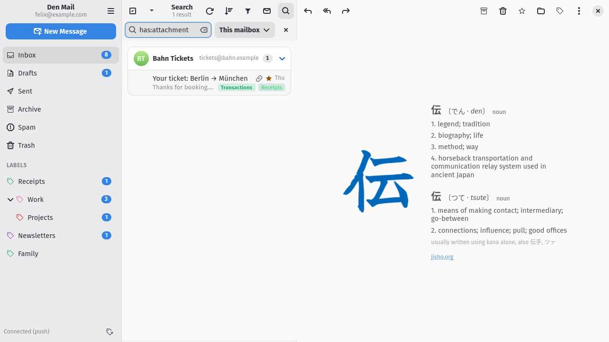

## Categories

Every message is sorted locally, with no server round trip and nothing sent
anywhere, into Primary, Transactions, Security, Updates, Newsletters, Lists or
Promotions. The rules read the list headers (`List-Post`, `List-Unsubscribe`,
`Precedence`, `Feedback-ID`), automated senders (`Auto-Submitted`, `noreply@`),
English and German wording for codes, sign-ins, receipts, orders and shipping,
and whether you have ever written to the sender. Rows show the category as a
chip (Primary shows none), and the funnel in the list header narrows the list
to one category; the list keeps loading pages until enough of that category is
on screen.

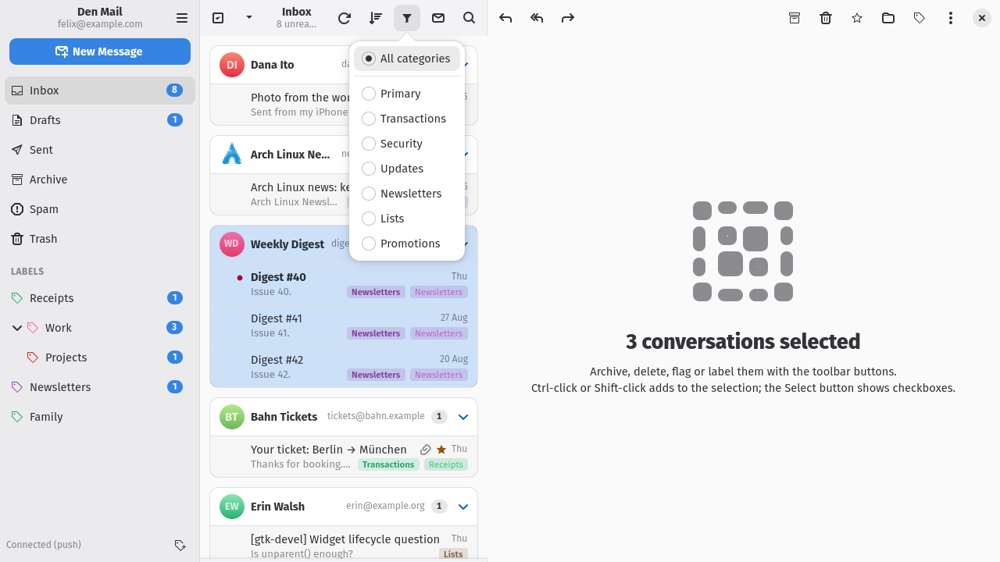

## Newsletters

*Newsletters…* in the main menu scans the account for mail that carries a
List-Unsubscribe header and lists one row per sender: how many messages, how
many unread, when the last one came, and how the sender lets you leave
(one-click request, an unsubscribe mail, or a web page). Tick the senders
you are done with, choose whether to keep, archive or delete their mail,
and press Unsubscribe. Requests go out one after another; a one-click
request that fails falls back to the sender's other methods, and a sender
you have already left shows the date.

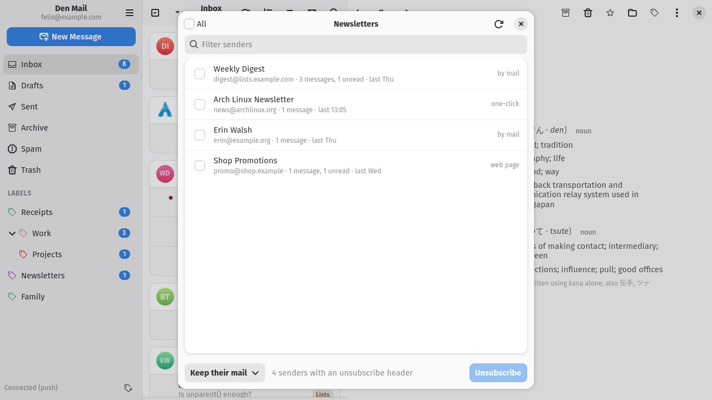

## Writing mail

The From field lists your starred identities first; "Show all identities…"
expands to every alias and wildcard address in the account.

## Identities and Masked Email

The identities dialog is where you star the aliases you actually send from.
Masked Email addresses can be created, described, switched off and deleted;
clicking one copies it.

| Identities & aliases | Masked Email |
| --- | --- |
| 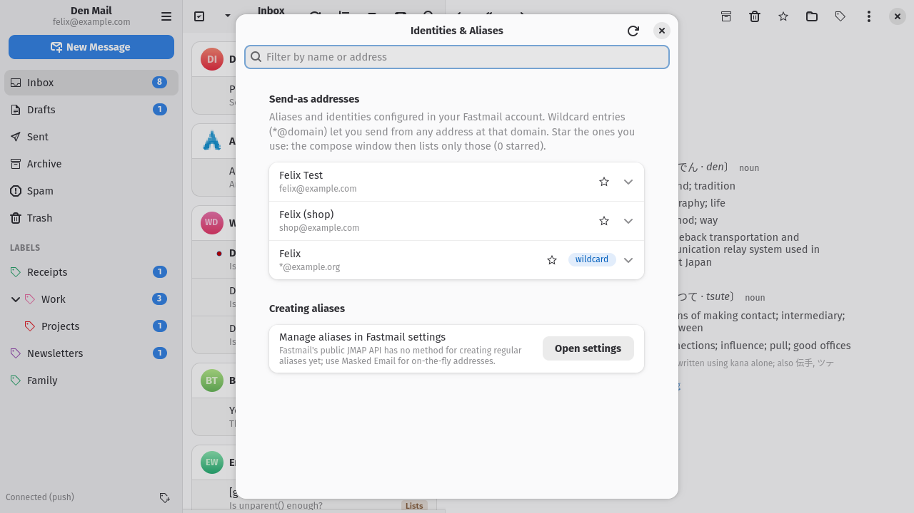 | 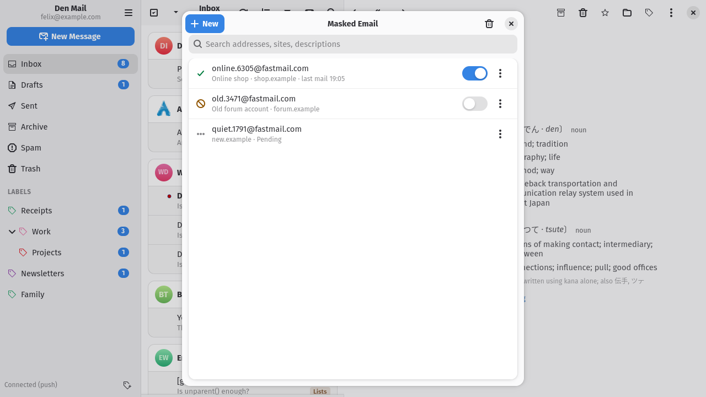 |

## Preferences

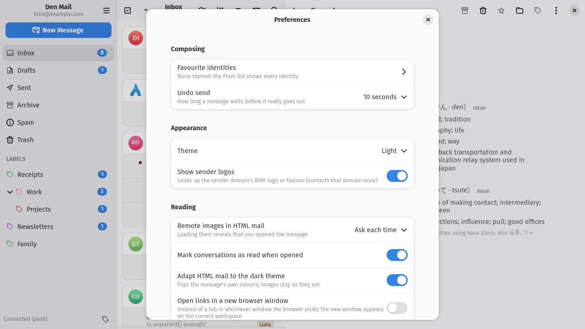

## Keyboard shortcuts

| Keys | Action |
| --- | --- |
| `j` / `k`, arrows | next / previous conversation |
| `Return` / `o` | open conversation (narrow layout) |
| `c`, `Ctrl+N` | new message |
| `r` / `a` / `f` | reply / reply all / forward |
| `e` | archive |
| `#`, `Delete` | delete |
| `!` | mark as spam |
| `s` | flag / unflag |
| `Shift+U` / `Shift+I` | mark unread / read |
| `l` / `v` | labels / move to |
| `/`, `Ctrl+F` | search |
| `g` then `i` / `d` | go to Inbox / Drafts |
| `F5`, `Ctrl+R` | refresh |
| `Ctrl+Return` / `Ctrl+S` | send / save draft (compose) |
| `Escape` | back (narrow layout) |
| `Ctrl+A` | select all |
| `Ctrl+,` / `Ctrl+?` / `Ctrl+Q` | preferences / shortcuts dialog / quit |
