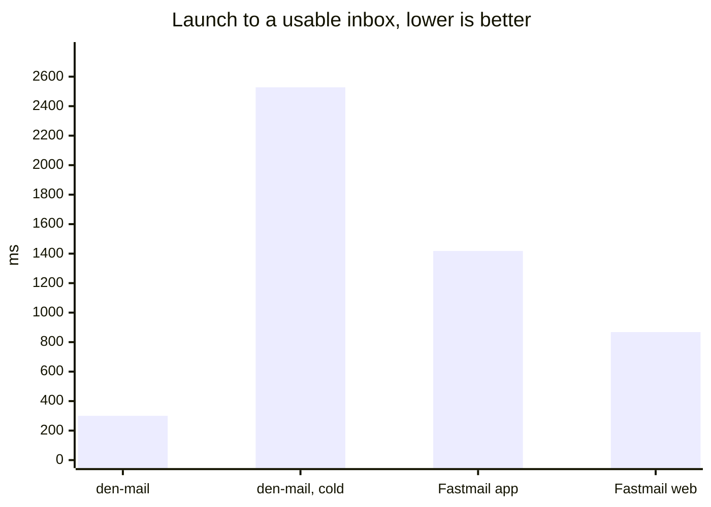
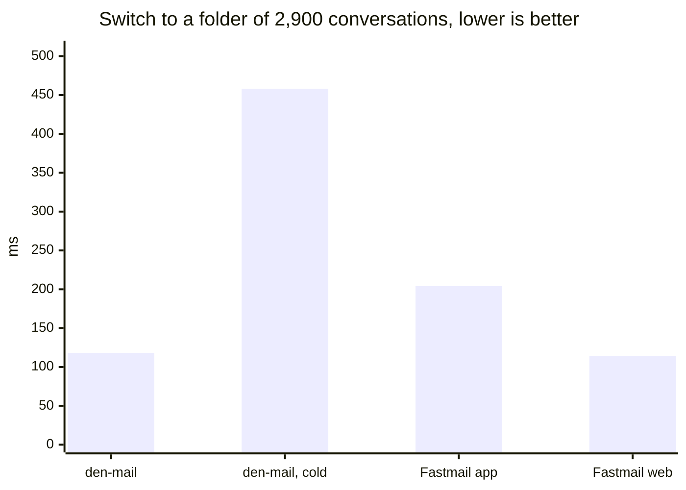
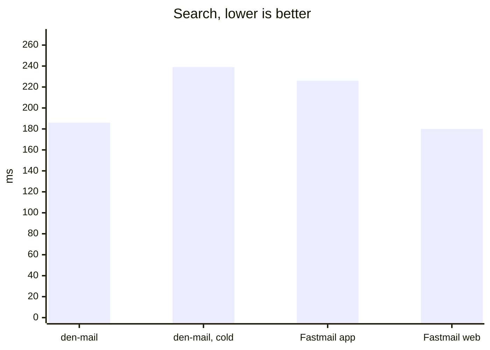
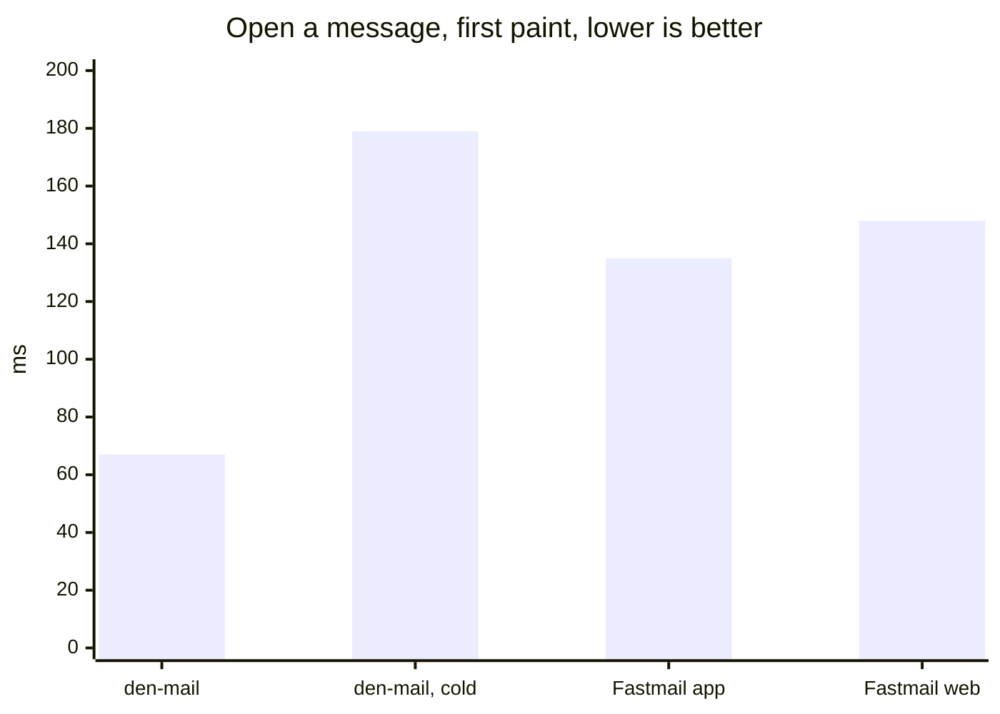
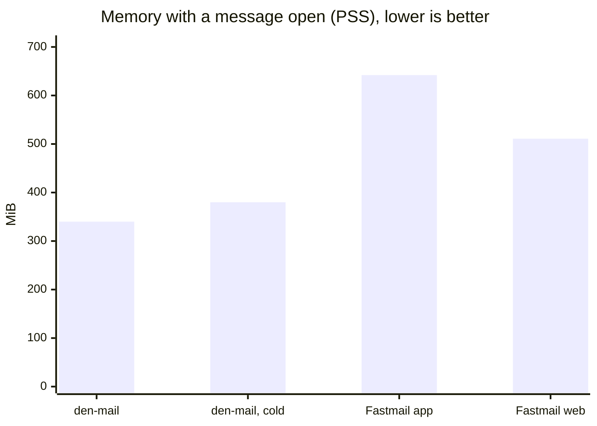
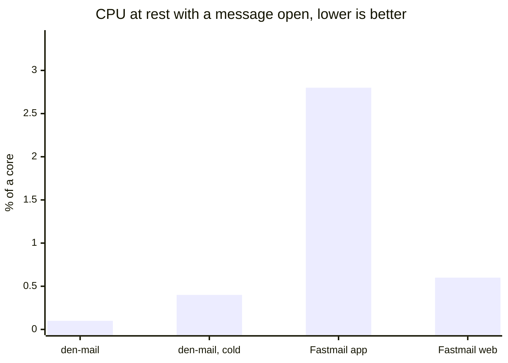

```mermaid
xychart-beta
    title "Launch to a usable inbox, lower is better"
    x-axis ["den-mail", "den-mail, cold", "Fastmail app", "Fastmail web"]
    y-axis "ms" 0 --> 2780
    bar [300, 2528, 1418, 868]
```

```mermaid
xychart-beta
    title "Switch to a folder of 2,900 conversations, lower is better"
    x-axis ["den-mail", "den-mail, cold", "Fastmail app", "Fastmail web"]
    y-axis "ms" 0 --> 510
    bar [118, 458, 204, 114]
```

```mermaid
xychart-beta
    title "Search, lower is better"
    x-axis ["den-mail", "den-mail, cold", "Fastmail app", "Fastmail web"]
    y-axis "ms" 0 --> 270
    bar [186, 239, 226, 180]
```

```mermaid
xychart-beta
    title "Open a message, first paint, lower is better"
    x-axis ["den-mail", "den-mail, cold", "Fastmail app", "Fastmail web"]
    y-axis "ms" 0 --> 200
    bar [67, 179, 135, 148]
```

```mermaid
xychart-beta
    title "Memory with a message open (PSS), lower is better"
    x-axis ["den-mail", "den-mail, cold", "Fastmail app", "Fastmail web"]
    y-axis "MiB" 0 --> 710
    bar [340, 380, 642, 511]
```

```mermaid
xychart-beta
    title "CPU at rest with a message open, lower is better"
    x-axis ["den-mail", "den-mail, cold", "Fastmail app", "Fastmail web"]
    y-axis "% of a core" 0 --> 3.4
    bar [0.1, 0.4, 2.8, 0.6]
```
