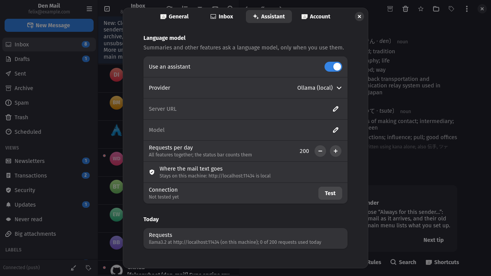
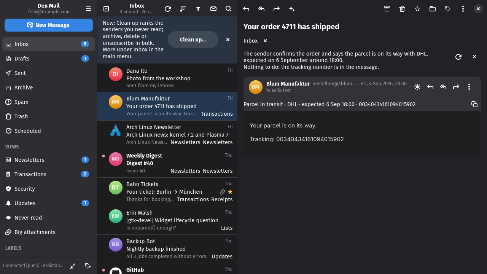

# Assistant and summaries

## Assistant and summaries

*Assistant* in Preferences (off by default) points the app at a language
model: Ollama on this machine, any server that speaks the OpenAI API (LM
Studio, llama.cpp, vLLM, OpenAI, Mistral, Groq, OpenRouter …) or Anthropic.
The server, the model, a key kept in the keyring, a requests-per-day limit
and a *Test* button that reaches the server without spending a request; a
row says whether the mail text stays on this machine or leaves it for the
chosen server. Thinking models are asked to skip the thinking on local
servers, so they answer instead of reasoning in silence.

With the assistant on, the sparkle in a conversation's header (or
Ctrl+Shift+S) sums the thread up in a few lines above the messages, quoted
history left out and older messages cut first so a long thread still fits a
small model. The answer is cached per thread: a second look is free, a new
reply asks again. In Clean up, an expanded sender row starts with a one-line
description of their newest message, so you can decide without opening
anything.

---
[Guide index](README.md) · [Tour](../TOUR.md)
