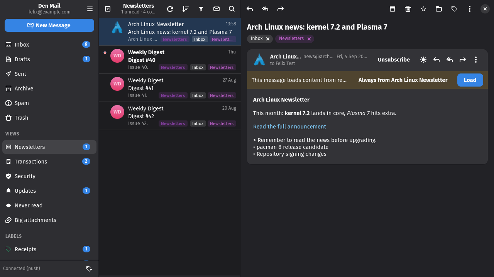

# Categories and views

## Categories

Every message is sorted locally, with no server round trip and nothing sent
anywhere, into Primary, Transactions, Security, Updates, Newsletters, Lists or
Promotions. The rules read the list headers (`List-Post`, `List-Unsubscribe`,
`Precedence`, `Feedback-ID`), automated senders (`Auto-Submitted`, `noreply@`),
English and German wording for codes, sign-ins, receipts, orders and shipping,
and whether you have ever written to the sender. Rows show the category as a
chip (Primary shows none), and the funnel in the list header narrows the list
to one category; the list keeps loading pages until enough of that category is
on screen.

A message that carries schema.org data, as shops, carriers, airlines and
booking sites add to theirs, is Transactions for sure and shows a line above
its body summing it up: "Parcel in transit · DHL · expected 6 Sep 18:00 ·
00340…", "Flight LH 123 · FRA → HEL · 12 Oct 09:40", with a button that
copies the tracking or reservation number. Only bodies already in the cache
are read; nothing is fetched for it.

When the rules get one wrong, right-click the conversation and choose
*Categorise as…*: your word is kept over the rules, and after a few such
corrections the app learns from them. The learned layer only speaks where
the rules were unsure (a message sorted into Primary for lack of signals,
say) and only when it is confident, and it sees what you do with a sender's
mail (never opened, deleted unread, written back), so a "friendly" sender
you never read stops counting as a newsletter. The message details, behind
the header, say why a message got its category: the rule that fired, your
choice, or what the model learned.

## Views

The *Views* section of the sidebar holds lists that no folder on the server
answers: Newsletters, Transactions, Security and Updates from the categories,
*Never read* for senders with two or more cached messages you have never
opened, the oldest at least two months old, and *Big attachments* for mail
with an attachment of 5 MB or more. They are SQL queries over the local cache,
so they open at once and cost no request; the badge counts what the cache
knows, which is every conversation listed since the app was installed, not
the whole account. A view behaves like a mailbox in the list: the same sort
menu, unread filter, multi-select, drag and drop, context menu and actions,
and a search typed while a view is shown narrows the view itself with the
operators above. Archiving from a view keeps the conversation in it (it is
still a newsletter); deleting or reporting spam removes it. Trash and Spam
never appear. *Views in the sidebar* in Preferences turns the section off.

## Label suggestions

The app learns from the mail you have labelled. Once a label has enough
examples and the model is sure about a conversation that lacks it, a dashed
chip such as *Work?* appears next to the labels; one click applies it. The
tooltip says how sure the model is and which words spoke for it. Folders are
never suggested; *Suggest labels* under *Inbox* in Preferences turns the chips
off.

---
[Guide index](README.md) · [Tour](../TOUR.md)
