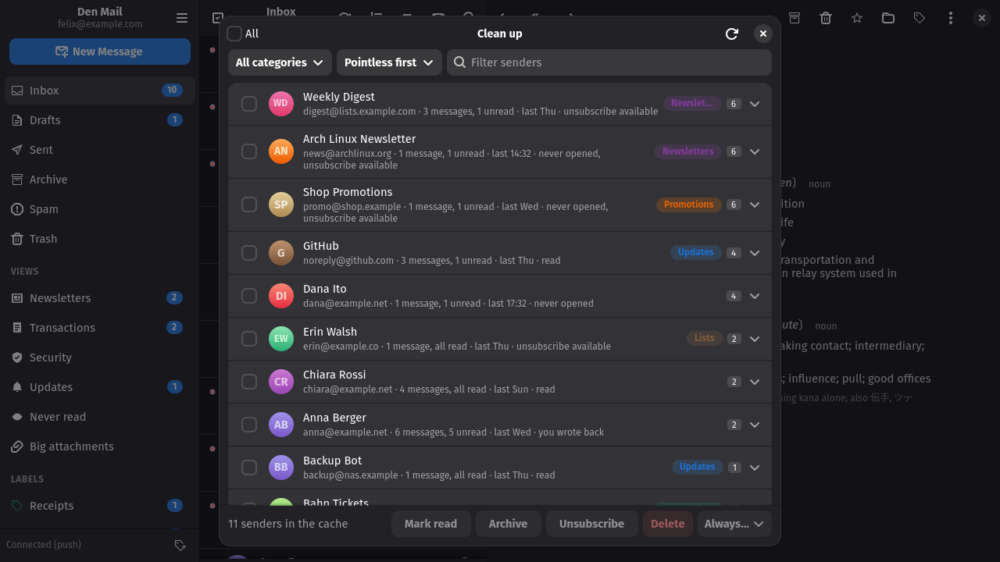
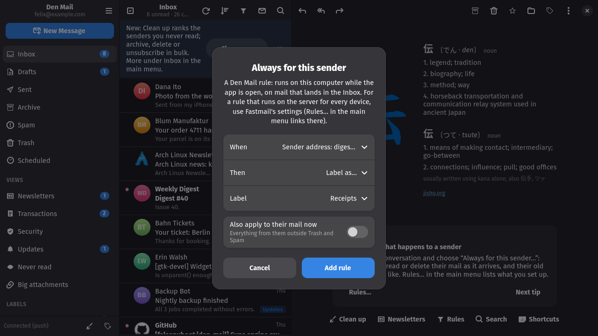
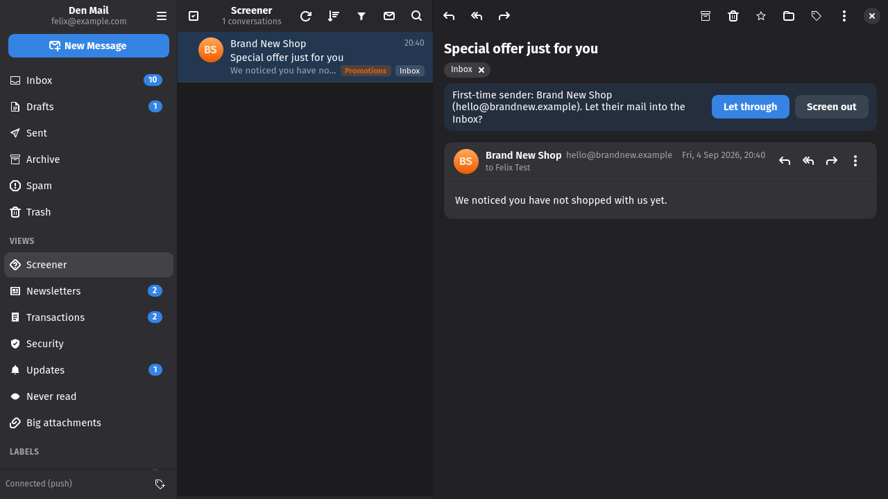

# Cleaning up

## Clean up

*Clean up…* in the main menu lists every sender in the local cache, the
most pointless first: how many messages, how many unread, when the last one
came, whether you ever wrote back, how much of their mail you threw away
unread, and whether they offer an unsubscribe method. The score behind the
order rewards volume that is never opened or deleted unread and drops below
zero for anyone you have replied to. Narrow the list to a category, sort by
volume, unread, date or size, and open a sender to see their newest
messages. Tick senders and press Mark read, Archive, Delete or Unsubscribe;
the first three reach every message from them on the server, not only the
cached ones, and can be undone from the toast. *Always…* adds a rule per
selected sender for their future mail and applies it now.

## Newsletters

*Newsletters…* in the main menu scans the account for mail that carries a
List-Unsubscribe header and lists one row per sender: how many messages, how
many unread, when the last one came, and how the sender lets you leave
(one-click request, an unsubscribe mail, or a web page). Tick the senders
you are done with, choose whether to keep, archive or delete their mail,
and press Unsubscribe. Requests go out one after another; a one-click
request that fails falls back to the sender's other methods, and a sender
you have already left shows the date.

## Rules

*Always for this sender…* in a conversation's context menu makes a rule: for
this address or for everyone at its domain, label the mail, archive it, mark
it as read or delete it, and optionally do that to their existing mail right
away. *Rules…* in the main menu lists the rules with how often each fired,
removes them, and adds rules on a list id or a whole category. Rules run in
the app when new mail lands in the Inbox, so they only work while Den Mail is
open; for rules that run on the server whether the app is open or not, the
dialog links to Fastmail's own rules settings.

## Screener

*Screen first-time senders* in Preferences (off by default) holds mail from
anyone the app has never seen, as a sender, a recipient or someone you
wrote to, in a *Screener* view instead of the Inbox, without a
notification. Open a conversation there and choose *Let through* (their
mail reaches the Inbox, this and every later one) or *Screen out* (their
mail is archived now, and a rule archives it from then on). The same two
choices sit in the conversation's context menu. The Inbox subtitle counts
what is being held. Only mail that arrives while the app runs is screened;
the backlog is never touched.

---
[Guide index](README.md) · [Tour](../TOUR.md)
