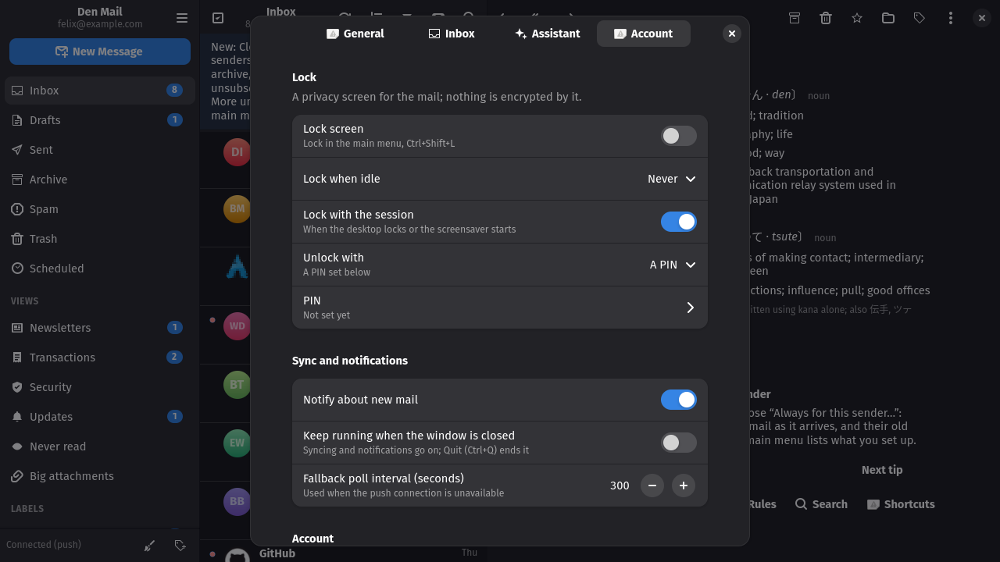

# Privacy and the background

## Lock

*Lock* in the main menu, or Ctrl+Shift+L, hides the mail behind a lock page
and hides the compose and conversation windows with it; a notification that
arrives meanwhile says "New mail" and nothing else. Turn the lock on under
*Account → Lock* in Preferences, choose to lock after some idle time and
when the desktop session locks, and choose what *Unlock* asks: the system's
own authentication prompt (password, fingerprint, whatever PAM is set up
for) where the polkit policy file is installed, which the AUR package does;
the keyring daemon's prompt for a *Den Mail* keyring of its own, which
works inside a Flatpak and never touches the login keyring; or a passphrase
or PIN set right there. This is a privacy screen, not a security boundary:
the cache and the token are not encrypted by it.

## Running in the background

*Keep running when the window is closed* under *Account* in Preferences
(off by default) makes closing the window hide it instead: mail keeps
syncing and notifications keep coming, a click on one opens that message,
and *Quit* in the main menu (Ctrl+Q) ends the app.

---
[Guide index](README.md) · [Tour](../TOUR.md)
